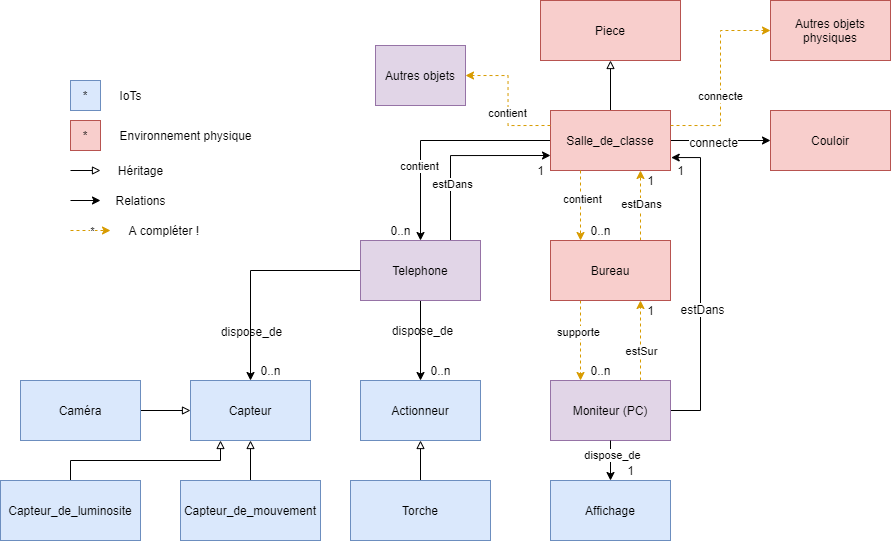
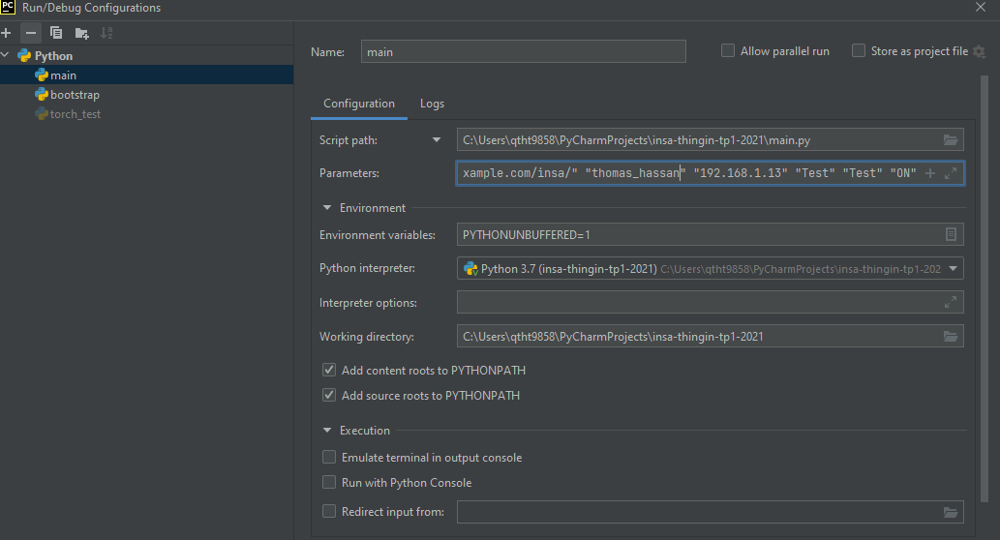

# Initiation ThingIn via PyDroidIpcam

Partly forked from https://github.com/home-assistant-libs/pydroid-ipcam 


### Requis : un PC avec python3 installé + Device android connectés au même réseau local et à internet
### Optionel : raspberry + sensehat, autre objets

##Objectif du TP : 

Ce TP a pour objectif de mettre en oeuvre les notions du cours par la création d'en environnement numérique représentant 
une partie de votre environnement physique proche. Cet environnement physique étant unique et partagé, 
son pendant numérique le sera également, et il sera construit conjointement avec vos camarades. 

Dans une première partie, vous construirez en collaboration cet environnement, sur la plateforme Thingin'the future, 
la plateforme de recherche d'Orange dédiée au web des objets. La construction de l'environnement inclue 
des objets connectés, ensemble composés des devices android présents dans la salle, ainsi que des autres objets 
IoT à votre disposition. Des scripts python vous sont fournis dans ce TP pour faciliter la mise en oeuvre des différentes
étapes de création et mise à jour des objets. En particulier, les scripts incluent les éléments nécessaires pour 
se connecter à la plateforme, constituer les données, et effectuer des requêtes de base. 
Vous devrez cependant éditer ces scripts / données pour ajouter des éléments manquants. 

La description de l'environnement est, dans cette première partie, fixée par un schéma de données simplifié. 
Ce schéma de données peut être vu comme un diagramme de classes simplifié, mais gardez en tête qu'il représente bien 
 **le graphe des objets de l'environnement**. 

La figure ci-dessous décrit le schéma. Vous n'aurez pas à construire ce schéma, cependant vous devrez le compléter dans
la fin de cette partie.




Dans la deuxième partie du TP, nous explorerons les capacités de recherche offertes par notre modélisation graphe, 
et étendrons la description de notre environnement à des concepts issus du web sémantique.


#Mise en place:

- installer l'apk "IP Webcam" sur votre device android
- activer les capteurs dans l'appli, accepter les demandes d'autorisations. Définir un mot de passe si souhaité
- télécharger le dépôt ci-dessus comprenant des données préconstruites et des scripts python d'update des données d'ipcam vers thingin (état de la torche, valeur du capteur de lumière...) 
- mettre en place un environnement python fonctionnel avec les dépendances du dépôt, où $PROJECT_FOLDER est le chemin d'accès au dossier pydroid-ipcam : 
	- ``` export PYTHONPATH=PYTHONPATH:$PROJECT_FOLDER/ , ou commande équivalente windows ```
	- ``` cd $PROJECT_FOLDER/thingin ```
	- Tous les scripts python3 utilisés dans le TP ci-dessous peuvent être lancés depuis un IDE ou un interpréteur avec les arguments suivants (ordre des arguments et syntaxe à respecter): 
	``` "$THING_TOKEN" "$THINGIN_DOMAIN" "$PRENOM_NOM" "$IPCAM_IP" "$IP_CAM_USER" "$IP_CAM_PWD" "$TORCH_ON_OFF" ``` 

		$THING_TOKEN : votre token à récupérer sur https://tech2.thinginthefuture.com (voir ci-après dans le descriptif du TP)
		$THINGIN_DOMAIN : domaine à utiliser où vos données seront enregistrées dans thingin (1 domaine commun à tous les étudiants). Le domaine à utiliser est : http://www.example.com/insa/
		$PRENOM_NOM : utilisé pour générer une clé unique (peut être une autre passphrase, tant qu'elle n'est pas partagée par d'autres étudiants). 
		$IPCAM_IP" : l'ip locale de votre device android où est installé android ipcam
		$IP_CAM_USER : Nom d'utilisateur du serveur android IP Webcam (à définir dans l’application)
		$IP_CAM_PWD : Password du serveur android IP Webcam (à définir dans l’application)
		$TORCH_ON_OFF : ON ou OFF (pour allumer / éteindre la torche du device, utilisé uniquement pour tester l’installation)
		Exemple : 
		``` python3 bootstrap.py "Bearer 12345" "http://www.example.com/insa/" "thomas_hassan" "192.168.1.18" "Test" "Test" "ON" ```
		
	Exemple de configuration via l'IDE (pycharm) : 


	
# Partie 1:
## Test d'installation et visualisation des données initiales : 
- Récupérer l'ip de votre device android 
- Se connecter à https://tech2.thinginthefuture.com. Les credentials à utiliser sont : 
    Email : thingin-demo@orange.com
    Password : thingin-demo147
- Récupérer son token : onglet Develop -> Get My Thing in token -> Copy to Clipboard
- Lancer le serveur android ipcam sur votre device. Si nécessaire changer la résolution vidéo et le login/mot de passe. Si pas de login mot de passe dans l'application, laissez les arguments vides ("") en lançant les scripts
- Tester l'environnement : exécuter le script torch_test.py en utilisant les arguments correspondants à votre installation. Exemple : ``` python3 torch_test.py  "Bearer 12345" "http://www.example.com/insa/" "thomas_hassan" "192.168.1.18" "Test" "Test" "ON" ```
- se (re)connecter à la plateforme ThingIn avec les credentials fournis pour vérifier vos données uploadées (et celles des autres étudiants)
- Se familiariser avec les vues du portail (graph2D / graph3D / Map / Raw) 
- Regarder l'api (swagger) de thingin. On accèdera ensuite à cette api à travers le code utilisé pour accéder et compléter vos données créées dans thingin. On l'utilisera également pour compléter le schéma de données de la première figure
- Ajouter votre device android à l'environnement partagé dans thingin:
    - Jeter un œil aux données qui vont être injectées, cf. fichier payloads.py
    - Exécuter le script bootstrap.py (avec arguments, cf. ci-dessus). Ce script complète les données, se connecte à la plateforme et ajoute des noeuds à l'environnement : le téléphone, certains de ses capteurs et actuateurs, et votre moniteur de PC (écran).
    - après exécution le fichier boostrap_result.json devrait être créé dans le répertoire courant et contenir la réponse de l’API thingin à la création, de la forme : 
        ``` [{"uuid": "b02531f3-8c48-480b-8259-aa256b7dbff3", "iri": "http://www.example.com/insa/androidIPCam-a82aeb9d-31a5-3f52-8714-4c47ae4e74fd", "isIn": []}, {"uuid":  .... ] ```
        où uuid est l'identifiant interne du noeud, et iri son identifiant global, suffixé par votre hash pour ce TP.
- Requêter l'ensemble de l'environnement partagé par une requête au portail thingin: 
    Onglet Explore -> Explore ThingIn Database -> Sélectionner la requête "Test your own domain" dans le menu déroulant -> cocher advanced mode -> entrer la requête suivante (requête de type POST)
    ```
    {	
      "query": {
        "$domain": "http://www.example.com/insa/2021/"
      },
      "view": {}
    }
    ```
 


- **Objectif Optionnel** : la requête ci-dessus renvoie les avatars communs à tous les étudiants. Pour sélectionner uniquement les noeuds/relations que vous venez de créer, nous allons exécuter une requête en profondeur à partir d'un de vos noeuds:
    - Toujours dans la page Explore the Thing in database, changer le type de requête : menu déroulant POST->GET
    - Récupérer l'identifiant interne du noeud correspondant au téléphone, dont l'iri est de la forme ``` http://www.example.com/insa/androidIPCam-$hash ```, stocké dans le fichier bootstrap_result.json. Il devrait s'agir du premier noeud de la liste. Bien prendre l'uuid, pas votre hash qui suit l'iri.
    - Entrer l'url de requête GET suivante à droite du menu déroulant : /avatars/$uuid?Read-Mode=depth&Read-Depth=10, en remplaçant $uuid par l'uuid récupéré précédemment
    - Le résultat de cette requête devrait contenir uniquement vos noeuds/relations et pas ceux de vos camarades

- Retrouver tous les téléphones : nous allons utiliser le language Cypher pour retrouver uniquement les téléphones des différents étudiants. Le résultat de la requête va donc évoluer en fonction de l'avancée des groupes. 


# Partie 2 : 

Dans cette partie nous allons :  
- mettre à jour de façon continue les données issues de nos capteurs / devices 
- utiliser effectuer des requêtes plus abouties sur l'environnement. 
- proposer des améliorations pour pallier les difficultées rencontrées dues à notre modèle de données simpliste.  


- Retrouver les endpoints de l’API android ipcam dans les propriétés des nœuds correspondants aux différents capteurs à travers l’interface ThingIn. Pour afficher les propriétés d'un noeud il suffit de cliquer dessus
- Lancer le script de mise à jour des données dans thingin, ```main.py```, qui accède à l'API du device, récupère les données et accède à l'API de thingin pour mettre à jour les noeuds précédemment créés de façon continue (environ toutes les 5 secondes)
- Vérifier la mise à jour des données dans thingin via la visualisation
- Les données qui ont été uploadées dans thingin par le bootstrapper sont décrites dans le fichier payloads.py. Nous allons créer de nouvelles données pour les compléter.
    - Construire un nouveau payload pour les noeuds (pièces et torche du device) ainsi créés, les assigner à une nouvelle variable dans payloads.py
    - Compléter ces données avec d'autres objets de l'environnement physiques (pièces et relations entre elles), en prenant en exemple les données existantes. 
        - Modifier bootstrap.py pour utiliser la variable contenant les nouveaux noeuds
    - Compléter les données manquantes pour le device IPcam (noeud décrivant le status actuel de la torche). Pour accéder à l'état de la torche et faire sa mise jour dans thingin, les fichiers thingin_requests.py et main.py doivent être édités : 
        - Définir une nouvelle fonction put_torch_status_thingin dans thinin_requests.py, en prenant exemple sur les fonctions existantes (motion et light)
        - Utiliser la fonction précédemment créée dans main.py, dans la fonction update_data(cam)
- Vérifier de nouveau la mise à jour des données dans thingin via la visualisation (relancer le script main.py)
- Optionnel : de la même façon que pour les nouveaux noeuds pour les pièces et la torche, déclarer des noeuds pour vos autres devices. 
    - Les classes à utiliser pour déclarer vos objets peuvent être recherchés dans thingin : Onglet explore -> ontology lookup service -> search classes in OLS
